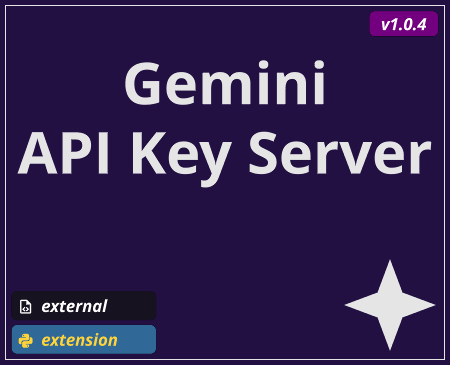
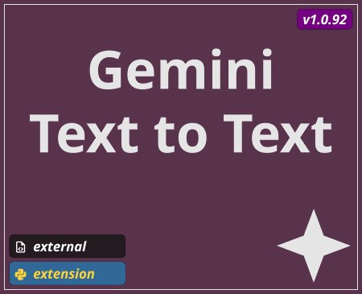
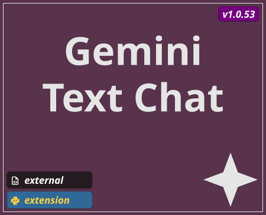
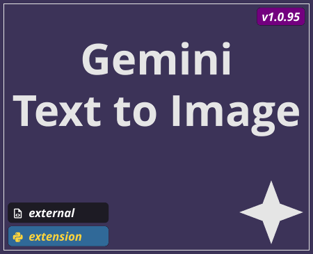
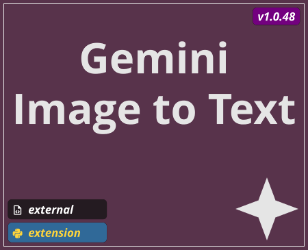
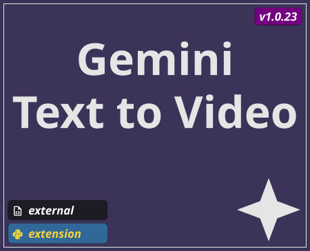
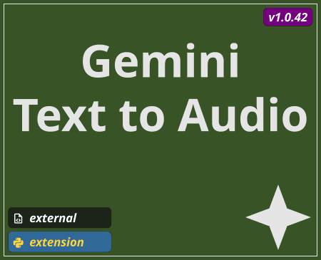
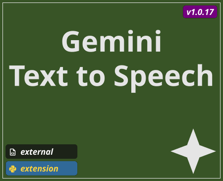

# TD Gemini Ops

*Thank you to UCLA for funding the initial development of this open source project.*

Here you'll find a collection of custom TouchDesigner Components that use the Google Gemini API. Focused on an library independent workflow, this set of components is a batteries included collection that requires no additional libraries or dependencies to get working.

## Common Controls and Parameters

### API Settings Page

Parameter Name | Parameter | Type | Description |
--- | --- | --- | --- |
Has API Key | `Hasapikey` | toggle | *(Read Only)* Indicator for if this COMP has an API Key set to use with Gemini API |
Add API Key | `Addapikey` | pulse | Adds an API key to this COMP |
Distribute API Key | `Distributeapikey` | pulse | Distributes the API key from this COMP to all other gemini COMPs |
Clear API Key | `Clearapikey` | pulse | Clears this COMP's API key |

### Gemini Page - Avialable on all Components

Parameter Name | Parameter | Type | Description |
--- | --- | --- | --- |
Generating | `Generating` | toggle | *(Read Only)* Indicator for if this COMP is currently waiting on a response from the Gemini API |
Request ID | `Requestid` | int | *(Read Only)* Used for tracking the current request for this COMP |
Model | `Model` | string or menu | Displays the model currently used - some components do not allow for changing the model selection
Auto Generate | `Autogenerate` | toggle | Toggle on to automatically submit request when the text input changes |
Generate | `Generate` | pulse | Manually start generation process |
Cancel | `Cancel` | pulse | Cancel the currently running request |

## Tools Inventory

### Utility Tools

TOX name `base_gemini_key_server`

Summary

A TouchDesigner component for generating synthetic text with the Google Gemini API based on an input prompt. The first input to this component should be a `Text DAT` - the contents of this `DAT` will be used as the prompt for generating text.

### Text to Text

TOX name `base_text_to_text`

Summary

A TouchDesigner component for generating synthetic text with the Google Gemini API based on an input prompt. The first input to this component should be a `Text DAT` - the contents of this `DAT` will be used as the prompt for generating text.

Controls

Parameter Name | Parameter | Type | Description |
--- | --- | --- | --- |
Default Prompt | `Defaultprompt` | string | The prompt used when no input `Text DAT` is connected |
Model | `Model` | menu | The Gemini Model to use for processing this text prompt |

Outputs

Output Index | Name | Type | Description |
--- | --- | --- | --- |
0 | `out_response` | `DAT` | Contains the response back from the Google Gemini API |
1 | `out_metadata` | `DAT` | Contains the metadata back from the Google Gemini API, this includes data like total token count, and prompt token count |

### Text Chat

TOX name `base_text_to_chat`

Summary

A TouchDesigner component for generating synthetic text with the Google Gemini API based on a chat style exchange. The first input to the Component is used as the input text for the model. The second input can be used to provide a chat history, or context, when interacting with the model.

Controls

Parameter Name | Parameter | Type | Description |
--- | --- | --- | --- |
Prompt | `Prompt` | string | The prompt used when no input `Text DAT` is connected |
Clear Length | `Chatlength` | int | The number length of the chat history |
Clear Chat History | `Clearchathistory` | pulse | Clears the chat history |

Outputs

Output Index | Name | Type | Description |
--- | --- | --- | --- |
0 | `out_chat` | `DAT` | Contains the response back from the Google Gemini API as a series of rows that contain both the user and model exchange |
1 | `out_chat_as_block` | `DAT` | A single text block formatted as a chat history |
2 | `out_metadata` | `DAT` | Contains the metadata back from the Google Gemini API, this includes data like total token count, and prompt token count |

### Text to Image

TOX name `base_text_to_img`

Summary
A TouchDesigner component for generating synthetic images with the Google Gemini API.

Controls

Parameter Name | Parameter | Type | Description |
--- | --- | --- | --- |
Default Prompt | `Defaultprompt` | string | The prompt used when no input `Text DAT` is connected |
Resolution | `Resolution` | menu | The output image resolution |
Aspect Ratio | `Aspectratio` | menu | The output image aspect ratio |

Outputs

Output Index | Name | Type | Description |
--- | --- | --- | --- |
0 | `out_response` | `TOP` | The image output from the Google Gemini API |
1 | `out_metadata` | `DAT` | Contains the metadata back from the Google Gemini API, this includes data like total token count, and prompt token count |

### Image to Text

TOX name `base_img_to_text`

Summary
A TouchDesigner component for generating synthetic text from an image and a prompt with the Google Gemini API.

Controls

Parameter Name | Parameter | Type | Description |
--- | --- | --- | --- |
Input Resolution | `Inputresolution` | menu | Downscale options for reducing the image resolution - reducing your input resolution by a half or quarter will help maintain high performance |
Default Prompt | `Defaultprompt` | string | The prompt used when no input `Text DAT` is connected |
Aspect Ratio | `Aspectratio` | menu | The output image aspect ratio |

Outputs

Output Index | Name | Type | Description |
--- | --- | --- | --- |
0 | `out_response` | `DAT` | Contains the response back from the Google Gemini API |
1 | `out_metadata` | `DAT` | Contains the metadata back from the Google Gemini API, this includes data like total token count, and prompt token count |

### Image and Text to Image

TOX name `base_img_to_img`

Summary
A TouchDesigner component for generating synthetic images from image and text inputs with the Google Gemini API.

Controls

Parameter Name | Parameter | Type | Description |
--- | --- | --- | --- |
Input Resolution | `Inputresolution` | menu | Downscale options for reducing the image resolution - reducing your input resolution by a half or quarter will help maintain high performance |
Use Input | `Useinput` | toggle | When on, uses the resolution and aspect ratio of the input image. When off, allows for overriding the resolution and aspect ratio |
Resolution | `Resolution` | menu | The output image resolution |
Aspect Ratio | `Aspectratio` | menu | The output image aspect ratio |
Default Prompt | `Defaultprompt` | string | The prompt used when no input `Text DAT` is connected |

Outputs

Output Index | Name | Type | Description |
--- | --- | --- | --- |
0 | `out_response` | `TOP` | The image output from the Google Gemini API |
1 | `out_metadata` | `DAT` | Contains the metadata back from the Google Gemini API, this includes data like total token count, and prompt token count |

### Text to Video

TOX name `base_text_to_video`

Summary
A TouchDesigner component for generating synthetic video with the Google Gemini API.

Controls

Parameter Name | Parameter | Type | Description |
--- | --- | --- | --- |
Default Prompt | `Defaultprompt` | string | The prompt used when no input `Text DAT` is connected |
Model | `Model` | Menu | The Gemini Model to use for processing this text prompt |
Resolution | `Resolution` | menu | The output image resolution |
Aspect Ratio | `Aspectratio` | menu | The output image aspect ratio |
Video Length | `Videolength` | menu | The duration of the output video |

Outputs

Output Index | Name | Type | Description |
--- | --- | --- | --- |
0 | `out_response` | `TOP` | The video output from the Google Gemini API |
1 | `out_response_audio` | `CHOP` | The video audio output from the Google Gemini API |
2 | `out_remote_path` | `DAT` | A table which contains the link to the remote asset generated by the Gemini API|

### Image to Video

TOX name `base_image_to_video`

Summary

Controls

Parameter Name | Parameter | Type | Description |
--- | --- | --- | --- |
Default Prompt | `Defaultprompt` | string | The prompt used when no input `Text DAT` is connected |
Model | `Model` | menu | The Gemini Model to use for processing this text prompt |
Resolution | `Resolution` | menu | The output image resolution |
Aspect Ratio | `Aspectratio` | menu | The output image aspect ratio |
Video

Outputs

Output Index | Name | Type | Description |
--- | --- | --- | --- |
0 | `out_response` | `TOP` | The video output from the Google Gemini API |
1 | `out_response_audio` | `CHOP` | The video audio output from the Google Gemini API |
2 | `out_remote_path` | `DAT` | A table which contains the link to the remote asset generated by the Gemini API|

### Audio to Text

TOX name `base_audio_to_text`

Summary

Controls

Parameter Name | Parameter | Type | Description |
--- | --- | --- | --- |
Source File | `Sourcefile` | file | Available when Use Source File is true, this allows you to select a file from disk to use for the audio transcription model |
Use Source File | `Usesourcefile` | toggle | Use a file from disk, or record audio directly in TouchDesigner |
Temp File | `Tempfile` | file | *(Read Only)* Path to currently used temp file |
Record | `Record` | toggle | turns recoding on and off |
Default Prompt | `Defaultprompt` | string | The prompt used when no input `Text DAT` is connected |

Outputs

Output Index | Name | Type | Description |
--- | --- | --- | --- |
0 | `out_response` | `DAT` | The text output from the Google Gemini API |
1 | `out_metadata` | `DAT` | Contains the metadata back from the Google Gemini API, this includes data like total token count, and prompt token count |

### Text to Audio

TOX name `base_text_to_audio`

Summary

Controls

Parameter Name | Parameter | Type | Description |
--- | --- | --- | --- |
Input Resolution | `Inputresolution` | menu | Downscale options for reducing the image resolution - reducing your input resolution by a half or quarter will help maintain high performance |
Include Image | `Includeimage` | toggle | Specifies if an input image will be used when submitting the prompt to the Gemini API |
Export Audio File | `Exportaudiofile` | pulse | Allows for exporting audio from component - using this parameter will open a dialog asking you where to save the file |
File | `File` | file | *(Read Only)* Path of source. |
Reload | `Reloadpulse` | pulse | Instantly reload the file from disk. |
Play | `Play` | toggle | Audio will playback when this is set to 1 and stop when set to 0. |
Speed | `Speed` | float | This is a speed multiplier which only works when Play Mode is Sequential. A value of 1 is the default playback speed. A value of 2 is double speed, 0.5 is half speed and so on. This node can not play audio backwards so negative values will not work well. |
Cue | `Cue` | toggle | Jumps to Cue Point when set to 1. Only available when Play Mode is Sequential. |
Pulse Cue | `Cuepulse` | pulse | Instantly jumps to the Cue Point. |
Repeat | `Repeat` | menu | Repeats the audio stream when the end is reached. |
Volume | `Volume` | float | Set the level the file is read in at. A setting of 1 is full signal while 0 is muted. |
Fade In/Out | `Fade` | toggle | about |

Outputs

Output Index | Name | Type | Description |
--- | --- | --- | --- |
0 | `out_response` | `TOP` | The video output from the Google Gemini API |
1 | `out_response_audio` | `CHOP` | The video audio output from the Google Gemini API |

### Text to Speech

TOX name `base_text_to_speech`

Summary

Controls

Parameter Name | Parameter | Type | Description |
--- | --- | --- | --- |
Default Prompt | `Defaultprompt` | str | The prompt used when no input `Text DAT` is connected |
Voice | `Voice`| menu | The available voice options for generating speech |
Export Audio File | `Exportaudiofile` | pulse | Allows for exporting audio from component - using this parameter will open a dialog asking you where to save the file |
File | `File` | file | *(Read Only)* Path of source. |
Reload | `Reloadpulse` | pulse | Instantly reload the file from disk. |
Play | `Play` | toggle | Audio will playback when this is set to 1 and stop when set to 0. |
Speed | `Speed` | float | This is a speed multiplier which only works when Play Mode is Sequential. A value of 1 is the default playback speed. A value of 2 is double speed, 0.5 is half speed and so on. This node can not play audio backwards so negative values will not work well. |
Cue | `Cue` | toggle | Jumps to Cue Point when set to 1. Only available when Play Mode is Sequential. |
Pulse Cue | `Cuepulse` | pulse | Instantly jumps to the Cue Point. |
Repeat | `Repeat` | menu | Repeats the audio stream when the end is reached. |
Volume | `Volume` | float | Set the level the file is read in at. A setting of 1 is full signal while 0 is muted. |
Fade In/Out | `Fade` | toggle | about |

Outputs

Output Index | Name | Type | Description |
--- | --- | --- | --- |
0 | `out_response` | `TOP` | The video output from the Google Gemini API |
1 | `out_response_audio` | `CHOP` | The video audio output from the Google Gemini API |
