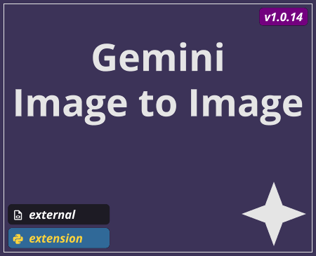

# Image to Image

TOX name `base_img_to_img`

## Summary
A TouchDesigner component for generating synthetic images from image and text inputs with the Google Gemini API.

## Controls

Parameter Name | Parameter | Type | Description |
--- | --- | --- | --- |
Input Resolution | `Inputresolution` | menu | Downscale options for reducing the image resolution - reducing your input resolution by a half or quarter will help maintain high performance |
Use Input | `Useinput` | toggle | When on, uses the resolution and aspect ratio of the input image. When off, allows for overriding the resolution and aspect ratio |
Resolution | `Resolution` | menu | The output image resolution |
Aspect Ratio | `Aspectratio` | menu | The output image aspect ratio |
Default Prompt | `Defaultprompt` | string | The prompt used when no input `Text DAT` is connected |

## Outputs

Output Index | Name | Type | Description |
--- | --- | --- | --- |
0 | `out_response` | `TOP` | The image output from the Google Gemini API |
1 | `out_metadata` | `DAT` | Contains the metadata back from the Google Gemini API, this includes data like total token count, and prompt token count |