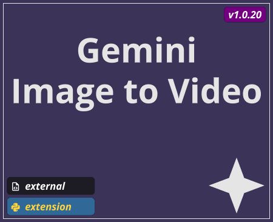

# Image to Video

TOX name `base_img_to_vid`

## Summary

## Controls

Parameter Name | Parameter | Type | Description |
--- | --- | --- | --- |
Default Prompt | `Defaultprompt` | string | The prompt used when no input `Text DAT` is connected |
Model | `Model` | menu | The Gemini Model to use for processing this text prompt |
Resolution | `Resolution` | menu | The output image resolution |
Aspect Ratio | `Aspectratio` | menu | The output image aspect ratio |
Video

## Outputs

Output Index | Name | Type | Description |
--- | --- | --- | --- |
0 | `out_response` | `TOP` | The video output from the Google Gemini API |
1 | `out_response_audio` | `CHOP` | The video audio output from the Google Gemini API |
2 | `out_remote_path` | `DAT` | A table which contains the link to the remote asset generated by the Gemini API|