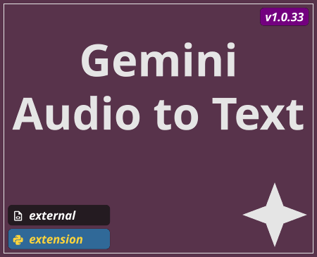

# Audio to Text

TOX name `base_audio_to_txt`

## Summary
A TouchDesigner component for generating synthetic text from audio with the Google Gemini API. Example use cases here include the ability to transcribe contents from a file to text.

## Controls

Parameter Name | Parameter | Type | Description |
--- | --- | --- | --- |
Source File | `Sourcefile` | file | Available when Use Source File is true, this allows you to select a file from disk to use for the audio transcription model |
Use Source File | `Usesourcefile` | toggle | Use a file from disk, or record audio directly in TouchDesigner |
Temp File | `Tempfile` | file | *(Read Only)* Path to currently used temp file |
Record | `Record` | toggle | turns recoding on and off |
Default Prompt | `Defaultprompt` | string | The prompt used when no input `Text DAT` is connected |

## Outputs

Output Index | Name | Type | Description |
--- | --- | --- | --- |
0 | `out_response` | `DAT` | The text output from the Google Gemini API |
1 | `out_metadata` | `DAT` | Contains the metadata back from the Google Gemini API, this includes data like total token count, and prompt token count |